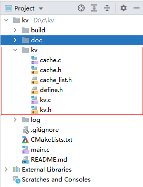
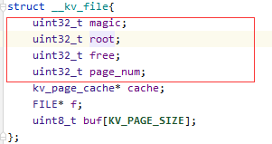
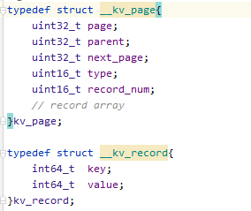

# 内部结构

## 代码模块
主要分b+树模块（kv.h、kv.c）以及缓存模块（cache.h、cache.c、cache_list.h)

## 数据文件结构

1. 文件头

   
文件头共16字节：
* magic 定义文件识别符号 0xefefefef
* root b+树根所在数据页
* free 空闲页列表的第一页
* page_num 数据页总数量
* 其余字段不会写入磁盘文件

2. 数据页(4k)

* kv_page 数据页定义
    * page 当前页页码(0保留)
    * parent 父节点页码
    * next_page 兄弟节点页码(在叶子节点使用)
    * type 页类型(区分叶子节点和内部节点)
    * record_num 当前页kv_record结构数量
    
* kv_record 数据页内保存记录数据
    * key 键值
    * value 叶子节点保存数据、内部节点保存子树节点页码
    * 对于内部节点 records[i].key对于records[i+1].value子树节点最小key值，所以最左子树页码保存在records[0].value
    * 对于叶子节点 records[i].key 对应records[i+1].value，所以records[0].value没用到
  
3. 缓存

缓存的最小单元是数据页，缓存内部分写缓存（脏数据页）、读缓存、空闲缓存。

* 当获取数据页时，查找顺序：写缓存 > 读缓存 > 使用空闲缓存加载数据
* 数据改动时缓存也会从 读缓存 更改到 写缓存
* 空闲缓存耗尽时会淘汰最早加载的读缓存页
* 写缓存达到一定数量是会批量写入磁盘
