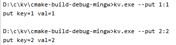
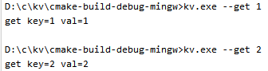
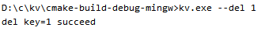
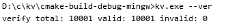
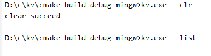
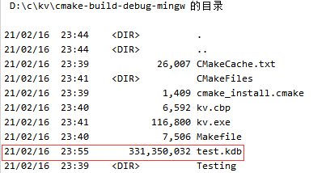

# 测试结果

## 功能测试
* put 设置

* get 获取

* del 删除

* list 列出所有记录

* ins 批量插入

* ver 校验（key==value）

* clr 清除记录

## 性能测试
* platform win10-mingw
* cpu      i5-8550U
* disk     ssd

### 批量插入1000,0000条key值递增的数据(单位：usec-微妙)
* 1000w条数据4.37秒插入完成，每秒228w左右
* 1000w条数据的数据文件约为331M

